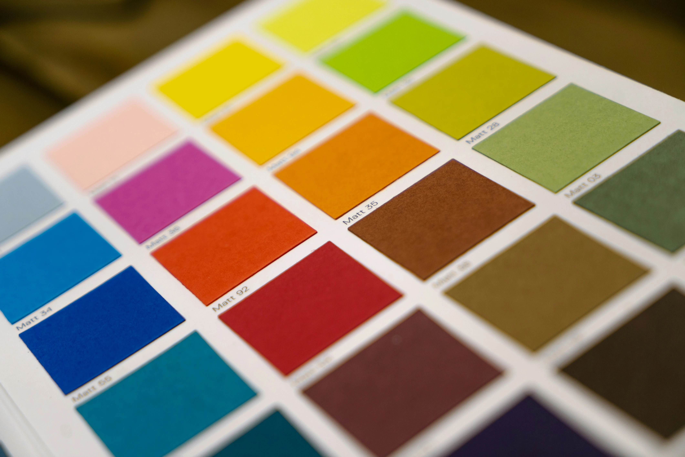
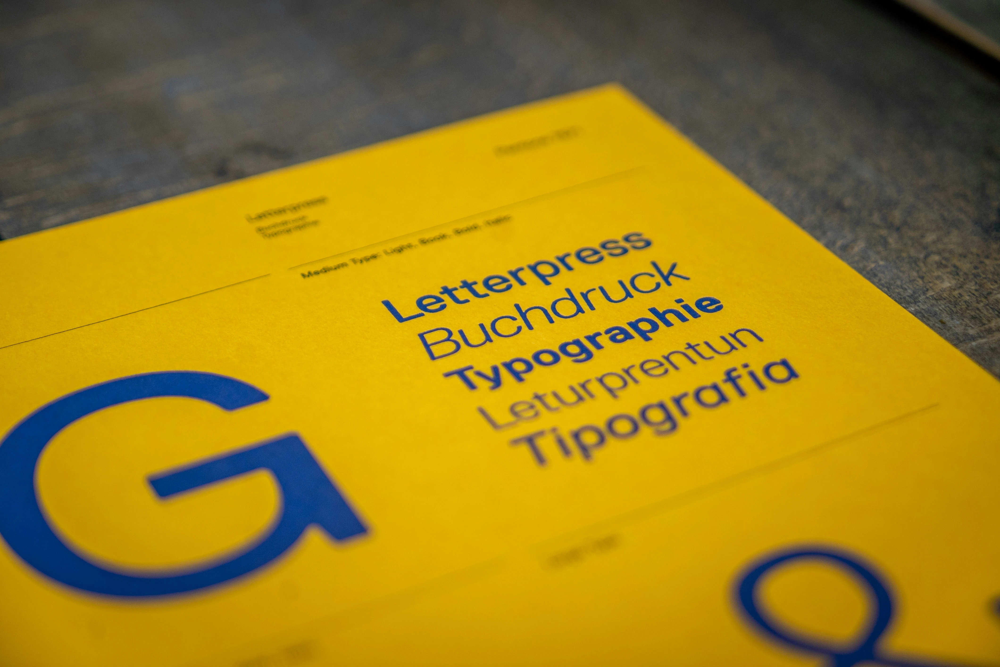
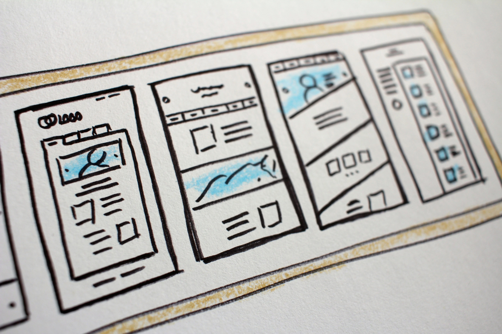

+++
title = 'Bridging the Gap: Basic Design Principles for Developers'
date = 2024-04-27T10:06:46+05:30
tags = ['UI', 'typography', 'design', 'improve']
+++

Developers typically focus on the coding and development aspects of a project. Clarity in roles is essential, with designers handling tasks from theme selection to UI design, passing the completed work to developers for implementation.

While this workflow has its advantages, it's crucial for developers to grasp basic design principles. Personally, I've experienced both approaches but lean towards involvement in both design and programming phases.

Here, I'll share resources to help developers grasp fundamental design principles, enhancing their ability to create significantly better products. I've curated beginner-friendly documentation covering areas such as color theory, typography, iconography, layout design, and general-purpose guides.

Think of these resources as references; there's no need to absorb everything at once. Instead, choose what's relevant to your current needs and revisit for additional guidance later on.

## 1. Colour (_Color_)
  

Understanding color theory is crucial for developers to create visually appealing designs. Concepts like color harmony and contrast enhance usability and aesthetics. The following guides delve into these concepts:  

  - [How to strategically use color in website design](https://www.flux-academy.com/blog/how-to-strategically-use-color-in-website-design#:~:text=To%20start%2C%20I%20recommend%20choosing,and%2010%25%20the%20accent%20color.)
  - [Color Theory Fundamentals Every Web Designer Should Know](https://elementor.com/blog/color-theory-web-design/)

You can jump to the following sites for designer-curated color palettes or even create your own:
  - [Color Hunt](https://colorhunt.co/) - "Color Hunt was created with the goal of celebrating the beauty of colors, and to serve as a go-to resource for color inspiration."
  - [Coloors](https://coolors.co/) - Create or choose the perfect palette, and use a range of tools, from image-color picker, contrast checker and palette visualizer.  

## 2. Typography
  

 Typography plays a significant role in user experience and interface design. Developers need to learn about font selection, sizing, and spacing to ensure readability and accessibility in their projects.  

  - [The Beginner's Guide to Typography in Web Design](https://blog.hubspot.com/website/website-typography)
  - [The Ultimate Guide To Best Free Font For UX UI Design](https://bootcamp.uxdesign.cc/the-ultimate-guide-to-best-free-font-for-ux-ui-design-abfea103e79)
  - [How To Use Typography In UI Design: A Beginners Guide](https://careerfoundry.com/en/blog/ui-design/typography-ui-design/)

## 3. Icons
  

 Icons are essential elements of UI design, aiding in navigation and communication of information. Developers should familiarize themselves with iconography principles to effectively integrate icons into their applications and websites.  

  - [Using Icons In Web Development](https://blog.openreplay.com/using-icons-in-web-development/)

Access icons for your websites, ranging from free to premium, on these top icon sites:  
  - [Font Awesome](https://fontawesome.com/)
  - [Icons8](https://icons8.com/) for icons and more _(illustrations, 3D assets, AI photo gen)_
  - [Iconify Design](https://icon-sets.iconify.design/) - Find popular open source icon sets

## 4. Layouts
  

The layout of a user interface influences how users interact with a product. Developers need to understand layout design principles such as grid systems, alignment, and spacing to create intuitive and visually pleasing interfaces.  

  - [Web Layout Best Practices: 12 Timeless UI Patterns Analyzed](https://www.toptal.com/designers/ui/web-layout-best-practices)
  - [In-depth Guidelines to Web Design Layout](https://www.ramotion.com/blog/web-design-layout-guidelines/)

____
Explore these two exemplary resources for general guidelines and best practices in exceptional web design:  

[9 Guidelines & Best Practices for Exceptional Web Design and Usability](https://blog.hubspot.com/blog/tabid/6307/bid/30557/6-guidelines-for-exceptional-website-design-and-usability.aspx)  
[Decoding Apple’s Design Magic: What It Teaches Us About Typography, Images, and Icons](https://bootcamp.uxdesign.cc/decoding-apples-design-magic-what-it-teaches-us-about-typography-images-and-icons-ed8e6e760f2d)  

## Conclusion

Treat this as a reference; select what you require and revisit as necessary. Understanding these fundamental principles is crucial for web developers, regardless of their involvement in the design process.