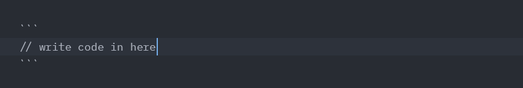
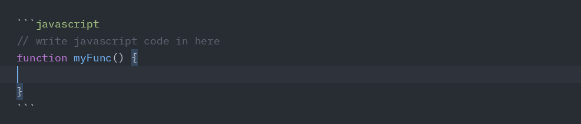

+++
title = 'Markdown: More With Less'
date = 2024-08-04T00:25:33+05:30
draft = false
tags = ["markdown", "writing", "productivity"]
+++
Every technical writer should use Markdown✍; At the very least, learn it 📖

Markdown is a lightweight markup language for creating formatted text using a plain-text editor. It is commonly used in blogging, instant messaging (you use it on Whatsapp for bold, italics etc.) and other cooler applications such as [writing Math articles with expressions](https://github.blog/news-insights/product-news/math-support-in-markdown/).

It's best feature? Simplicity 💯

I use markdown for blogging on dev.to and on my [personal blog](https://thejoernal.netlify.app) site which is built on [Hugo](https://gohugo.io/).
I use it for notes, task lists, reports and of course project documentation. MD(Markdown) is highly extensible and can be used in numerous applications.

Some important features that I heavily lean into in my workflow include:

## 1.Headings

```md
  # heading 1
  ## heading 2
  ### heading 3
  #### heading 4
  ##### heading 5
  ###### heading 6
```

**Output**:
# heading 1
## heading 2
### heading 3
#### heading 4
##### heading 5
###### heading 6

<br>

## 2. Embedding links in text and link references

  ```md
    [some text](https://some.website)
  ```
**Output**: [some text](https://some.website)


## 3. Embedding media such as images and videos
  - For images:
  ```md
  
  ```

  - For Videos, there is more than one way to do it. The easiest in my opinion is using the  `HTML` `<video>` tag.

  Another way is to embed a video using hosting services such as youtube and vimeo which provide you an embed code that you can copy and paste into your markdown file:

  ```md
    <iframe width="560" height="315" src="https://www.youtube.com/embed/video-id" frameborder="0" allow="accelerometer; autoplay; clipboard-write; encrypted-media; gyroscope; picture-in-picture" allowfullscreen></iframe>
  ```

  Another is using the markdown-specific syntax for embedding videos. There are different syntax for different platforms. For example YouTube and Vimeo etc.

  ```md
    [](https://www.youtube.com/watch?v=video-id)
  ```

  Whichever method you choose to use, keenly consider user experience.


## 4. Checkboxes for todos

  ```md
    - [ ] Write blog
    - [ ] Publish blog
    - [ ] Create summary
  ```
**Output**:
  - [ ] Write blog
  - [ ] Publish blog
  - [ ] Create summary

Note that the checkboxes are rendered on most markdown readers but not all, for example on the dev.to site.


## 5. Lists

  ```md
    - item 1
    - item 2
    - item 3
  ```
**Output**:
  - item 1
  - item 2
  - item 3


## 6. Quotes/Block Quotes

  ```md
    > "Markdown is a simple and efficient language for documentation and note taking", theJoernal.
  ```
**Output**:
  > "Markdown is a simple and efficient language for documentation and note taking", theJoernal.


## 7. Code snippets and blocks (I mostly use this in tutorials)
  - For inline code snippets, use single backticks
  - For larger codeblocks, use triple backticks;
  Three to open the block and three after the code to close it.



## 8. Syntax highlighting in codeblocks

To get Syntax highlighting in code blocks, add the language name immediately after the opening backticks:




<br>Markdown tooling is not an issue;
You prefer working on VS Code? You can. On Notepad or Vim? You're covered. And now, you can do it on [Zed Editor](https://zed.dev/) (I am testing it on Linux at the moment), which has inbuilt markdown support.

Apart from these popular text editors and IDEs, there are also several [Markdown-specific editors](https://blog.hubspot.com/website/wysiwyg-markdown-editor), that pack in some goodies.
Some honourable mentions that I've personally enjoyed using in the past include:

- [Obsidian](https://obsidian.md/) (All Platforms)
- [Typora](https://typora.io/) (Linux, Mac, Win)
- [Notion](https://www.notion.so/) (Mac, Win, Android, IOS)
- [iA Writer](https://ia.net/) (Mac, Win, Android, IOS)
- [Simplenote](https://simplenote.com/) (Linux, Mac, Win, Android, IOS)
- [InkDrop](https://www.inkdrop.app/) (Linux, Mac, Win, Android, IOS)

Find out more about markdown here: [Getting Started with Markdown](https://www.markdownguide.org/getting-started/)

Do you use Markdown?
