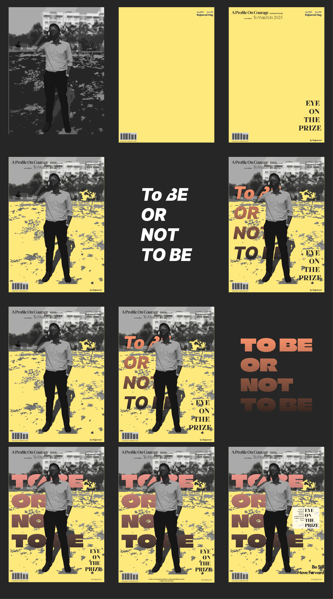
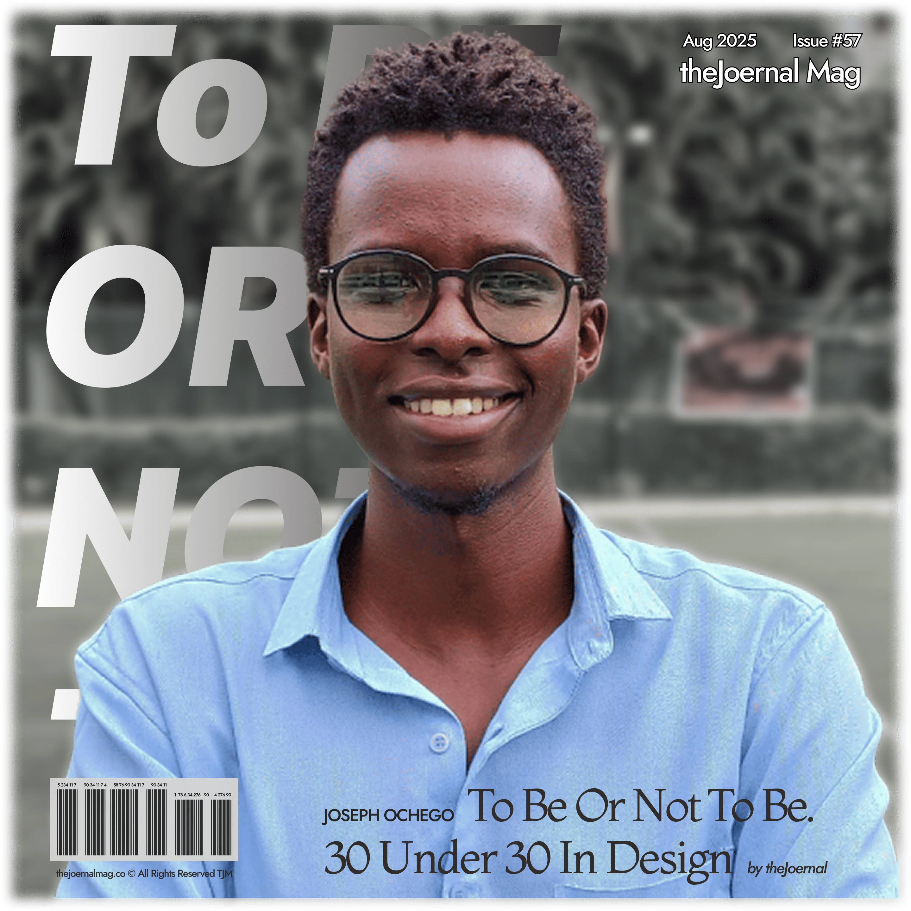
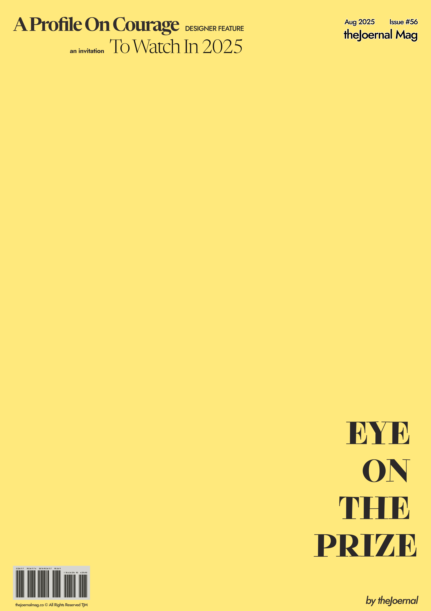
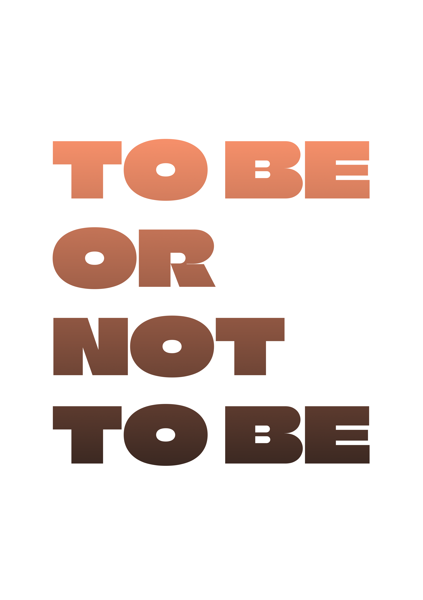
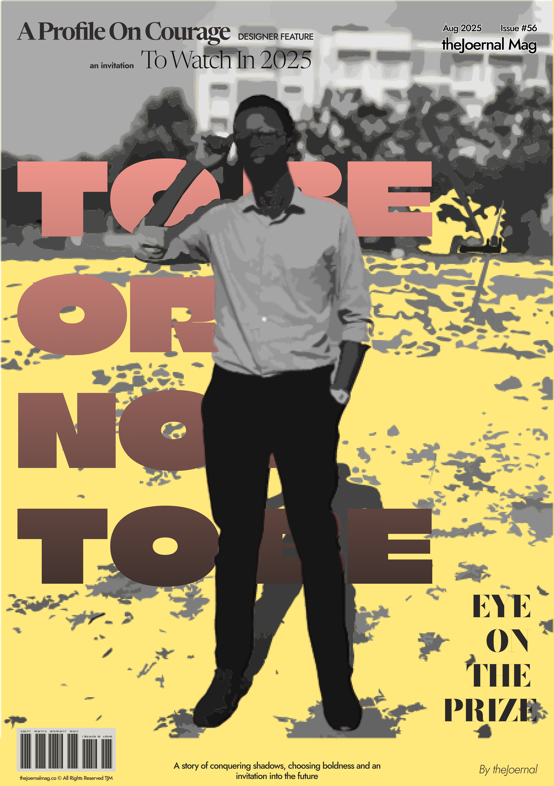
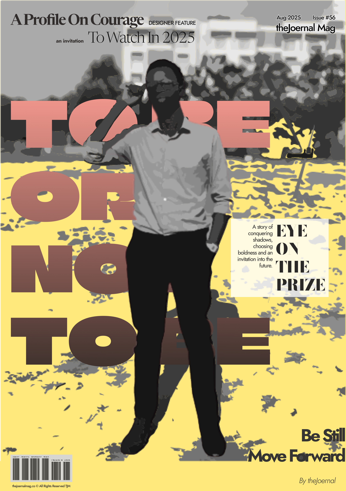

+++
title = 'Wandering Artist'
date = 2025-08-11T15:43:00+03:00
draft = false
tags = ['discovery', "design", 'iterate']
+++

There’s a power that comes with having no idea, in design at least.

Tinker Hatfield started exploring shoe design after his athletics career-ending injury. And alas, Nike’s Air Maxes were born.

I’ve always enjoyed design — graphic, web, fashion (apparently my taste here is very questionable 😂), motor vehicle, but especially digital product design. I’ve even done a few gigs for a few pennies, resulting in happy clients. But passion doesn’t guarantee competence. I’ve always been rough around the edges when it comes to the rules and principles of design.

When I was thinking about today’s piece, I wanted to claim that ignorance has been my advantage. But honestly, no; I’d be a better designer with a firm grasp of the fundamentals. Guidelines exist for a reason.

Still, there’s a power in not knowing. No boundaries. Just passion and limitless tools. Without guiderails, you wander, and in wandering, you discover. You mix shades into new colours, stumble into strange concoctions, and sometimes, hit gold. Sure, you’ll trip over plenty of rocks along the way, but probability says you’ll eventually hit a gold ore.

This line of thought came from my latest experiment: magazine cover design. I started with a simple image and some text layouts. After posting the first one, I browsed actual magazine covers and realised how far off-track I was. A [video from Envato Tuts+](https://www.youtube.com/watch?v=o0AxPJVTkWI&pp=0gcJCfwAo7VqN5tD) confirmed it, my design was even more off than I’d thought.

<figure>
    
    <figcaption>Issue #56 Design Progression</figcaption>
</figure>

Then I tried adding a barcode. Totally non-functional, purely aesthetic; but it instantly looked more like a “real” magazine cover. That small tweak felt like a win… until I realised why barcodes exist and how space is intentionally left for the publisher in professional design.

<figure>
    
    <figcaption>First Issue (#57) Mag Design Cover w/o Barcode</figcaption>
</figure>
<figure>
    
    <figcaption>First Issue (#57) Mag Design Cover With Barcode</figcaption>
</figure>

Other differences stood out too. My magazine name, theJoernal Mag, sat in small text with a stroke, while mainstream covers like VOGUE or TIME shout their names in the largest type on the page. I put the date and issue number above the name instead of using the conventional “Volume / Issue” format. And of course, my series counts backwards from Issue #57 to #0. Breaking rules without even knowing they existed? Absolutely.

<figure>
    
    <figcaption>Issue #56 Cover Canvas</figcaption>
</figure>
<figure>
    
    <figcaption>Issue #56 Cover New Headline Font</figcaption>
</figure>
<figure>
    
    <figcaption>Issue #56 Cover With Footnote</figcaption>
</figure>
<figure>
    
    <figcaption>Issue #56 Cover With White Textbox</figcaption>
</figure>

Eventually, I stopped myself. If I follow every rule to the letter, my covers won’t feel like mine. They won’t be different. They won’t be memorable. And they certainly won’t have that little ingredient I’ve recently discovered: the power to irritate some people and delight others.

So yes, I’m learning the rules. But I’m also keeping my bias towards making it personal - throwing spaghetti at the wall and seeing what sticks.

Artistic wandering.

<figure>
    
    <figcaption>Notebook Mockup after Illustration Design in Figma</figcaption>
</figure>